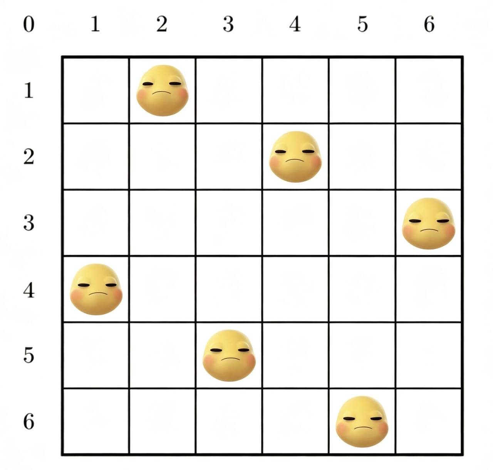

<h1>深度优先搜索：</h1>

深度优先搜索就是：“一条路走到黑，走不通再回头”。

从起始点出发，沿着某条路径一直往深处走，直到走不动了，就回溯到上一个分叉点，换一条路继续走，直到所有能到达的节点都被访问过。

下面我们看一下他的基础模板：

```cpp linenums="1" title="dfs.cpp"
void dfs(int node,vector<vector<int>>&graph,vector<bool>&visited){//node表示当前正在访问的节点
  cout<<node<<" ";//访问当前节点
  visited[node]=true;//标记当前节点已访问
  for(auto neighbor:graph[node]){//遍历当前节点的所有相邻节点
    if(visited[neighbor])continue;//如果相邻节点被访问过，跳过。
      dfs(neighbor,graph,visited);//递归调用dfs函数，访问这个相邻节点
  }
    
}
```
由于树是无环图，所以我们在dfs函数中不需要回溯。

我们优化一下

```cpp linenums="1" title="dfs.cpp"
void dfs_tree(int node,int parent,vector<vector<int>>&graph){
  cout<<node<<" ";
  for(auto neighbor:graph[node]){
    if(neighbor==parent)continue;
    dfs_tree(neighbor,node,graph);
  }
}
```
我们来几道简单题：

<h2>全排列：</h2>

本题给你一个数n，要求你输出1~n的全排列。

1<=n<=9 如：n=3 则全排列为：
1 2 3
1 3 2
2 1 3
2 3 1
3 1 2
3 2 1

```cpp linenums="1" title="全排列.cpp"
#include<bits/stdc++.h>
using namespace std;
int n;
int a[10];
bool used[10];
void dfs(int step){
  if(step>=n+1){
    for(int i=1;i<=n;i++)cout<<a[i];
    cout<<endl;
    return;
  }
  for(int i=1;i<=n;i++){
    if(!used[i]){
      used[i]=true;
      a[step]=i;
      dfs(step+1);
      used[i]=false;
    }
  }

}
int main(){
  cin>>n;
  dfs(1);
  return 0;
}
```
好的本喵来喵喵几句：

我们写dfs的时候可以注意到大部分都是这样的模板：

如果当前数字大于了n，说明当前路径已经走完了，我们可以输出当前路径。

循环是枚举当前路径上的数字，如果当前数字没有被使用过，我们就把它放到当前路径上，递归调用dfs

函数，访问这个相邻节点。最后我们回溯，把当前数字上的数字标记为未被使用过。

我们再来一题：
<h2>走迷宫：</h2>
给你一个n*m的迷宫，0表示空地，1表示障碍。

要求你从(1,1)出发，走到(n,m)，如果可以走到(n,m)，则输出"Yes"。

如果不能走到(n,m)，则输出"No"。

```cpp linenums="1" title="走迷宫.cpp"
#include<bits/stdc++.h>
using namespace std;
int n,m;
int dx[4]={0,0,-1,1};
int dy[4]={1,-1,0,0};
vector<vector<int>> maze;
vector<vector<bool>> visited;

void dfs(int x,int y){
  if(x==n && y==m){
    cout<<"Yes"<<endl;
    exit(0);
  }
  visited[x][y]=true;
  for(int i=0;i<4;i++){
    int nx=x+dx[i];
    int ny=y+dy[i];
  
     if(nx>=1 && nx<=n && ny>=1 && ny<=m && maze[nx][ny]==0 && !visited[nx][ny]){
      dfs(nx,ny);  
     }
  }
}
int main(){
  cin>>n>>m;
  maze.resize(n+1,vector<int>(m+1));
  visited.resize(n+1,vector<bool>(m+1));
  for(int i=1;i<=n;i++){
    for(int j=1;j<=m;j++){
      cin>>maze[i][j];
    }
  }
  visited[1][1]=true;
  dfs(1,1);
  cout<<"No"<<endl;
  return 0;
}

```
因为这道题只要求输出有无路径，所以我们在dfs函数中不需要回溯。

但是如果是问我们有多少种走法，那么我们就需要回溯。

我们来看一下回溯迷宫：

<h2>回溯迷宫：</h2>
给你一个n*m的迷宫，0表示空地，1表示障碍。

要求你从(1,1)出发，走到(n,m)，输出有多少种走法。
```cpp linenums="1" title="回溯迷宫.cpp"
#include<bits/stdc++.h>
using namespace std;
int n,m;
int dx[4]={0,0,-1,1};
int dy[4]={1,-1,0,0};
vector<vector<int>> maze;
vector<vector<bool>> visited;
int total=0; // 总方案数;
void dfs(int x,int y){
  if(x==n && y==m){
  total++;
  return;
  }
  visited[x][y]=true;
  for(int i=0;i<4;i++){
    int nx=x+dx[i];
    int ny=y+dy[i];
    if(nx>=1 && nx<=n && ny>=1 && ny<=m && maze[nx][ny]==0 && !visited[nx][ny]){
      dfs(nx,ny);
      visited[nx][ny]=false;
    }
  }
}
int main(){
  cin>>n>>m;
  maze.resize(n+1,vector<int>(m+1));
  visited.resize(n+1,vector<bool>(m+1));
  for(int i=1;i<=n;i++){
    for(int j=1;j<=m;j++){
      cin>>maze[i][j];
    }
  }
  dfs(1,1);
  cout<<total<<endl;
  return 0;
}


```


来一道题：<h1 style="\\\*\\\*font-weight:bold; color:#222;\\\*\\\*">奶娃的笑：</h1>

<div style="text-align:center;">
</div>


奶娃的笑会传染，奶娃会大笑与其处在同一行或者同一列以及同一对角线上的奶娃。
现在有n个奶娃，要求把这n个奶娃放置在n*n的网格中，每个奶娃只能放在一个网格中，不能放在同一个网格中并且奶娃不能大笑。
求有多少种放置方法。1<=n<=9

<div style="text-align:center; margin:20px 0;">
  <video autoplay loop muted playsinline style="width:320px; max-width:100%; border-radius:8px;">
    <!-- 去掉开头的斜杠，改成相对路径 -->
    <source src="../assets/shipin/naiwa.mp4" type="video/mp4">
  </video>
</div>

```cpp linenums="1" title="奶娃的笑.cpp"
#include<bits/stdc++.h>
using namespace std;
int n;
int ans[15]; // ans[i]保存第i行奶娃放在第几列
bool vis_col[15];    // 列标记
bool vis_d1[30];     // row-col+n 对角线
bool vis_d2[30];     // row+col 对角线
int total = 0;       // 总方案数

void dfs(int row){
    if(row == n+1){ // 行从1开始，1~n行全部放完
        total++;
        if(total <=3){ // 只输出前3组
            for(int i=1;i<=n;i++) cout<<ans[i]<<" ";
            cout<<endl;
        }
        return;
    }
    // 枚举当前行所有列，从左往右，保证字典序
    for(int col=1;col<=n;col++){
        int d1 = row - col + n;
        int d2 = row + col;
        if(!vis_col[col] && !vis_d1[d1] && !vis_d2[d2]){
            // 放置奶娃
            vis_col[col]=true;
            vis_d1[d1]=true;
            vis_d2[d2]=true;
            ans[row]=col;

            dfs(row+1); // 搜下一行

            // 回溯，撤销标记
            vis_col[col]=false;
            vis_d1[d1]=false;
            vis_d2[d2]=false;
        }
    }
}

int main(){
    cin>>n;
    dfs(1); // 从第1行开始放
    cout<<total<<endl;
    return 0;
}
```


我们来看一道题：

<h1 style="\\\*\\\*font-weight:bold; color:#222;\\\*\\\*">单词搜索：</h1>

给你两个数m，n，表示网格的行数和列数。给你一个单词word，表示要搜索的单词。如果word在网格中，返回true，否则返回false。

单词必须按照字母排序，通过相邻的单元格内的字母构成。其中“相邻”单元格是水平相邻或垂直相邻的单元格。
同一单元格内的字母不允许重复使用。

```cpp linenums="1" title="单词搜索.cpp"
#include<bits/stdc++.h>
using namespace std;

int dx[4]={0,0,1,-1};
int dy[4]={1,-1,0,0};
int m,n;
string word;
bool dfs(int x,int y,int index,vector<vector<char>>&board,vector<vector<bool>>&visited){
  if(board[x][y]!=word[index])return false;
  if(index==word.size()-1)return true;
  visited[x][y]=true;
  for(int i=0;i<4;i++){
    int nx=x+dx[i];
    int ny=y+dy[i];
    if(nx<0||nx>=m||ny<0||ny>=n||visited[nx][ny])continue;
    if(dfs(nx,ny,index+1,board,visited))return true;
  }
  visited[x][y]=false;
  return false;
}
int main(){
  cin>>m>>n;
  vector<vector<char>>board(m,vector<char>(n));
  for(int i=0;i<m;i++){
    for(int j=0;j<n;j++){
      cin>>board[i][j];
    }
  }
  cin>>word;
  vector<vector<bool>>visited(m,vector<bool>(n));
  bool found=false;
  for(int i=0;i<m;i++){
    for(int j=0;j<n;j++){
      if(dfs(i,j,0,board,visited)){
        found=true;
        break;
      }
    }
    if(found)break;
  }
  if(found)cout<<"true"<<endl;
  else cout<<"false"<<endl;
  return 0;
}
```