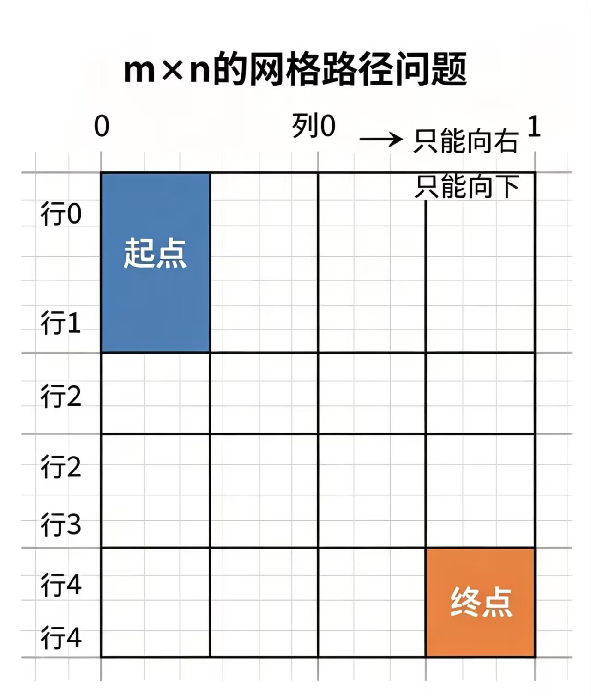
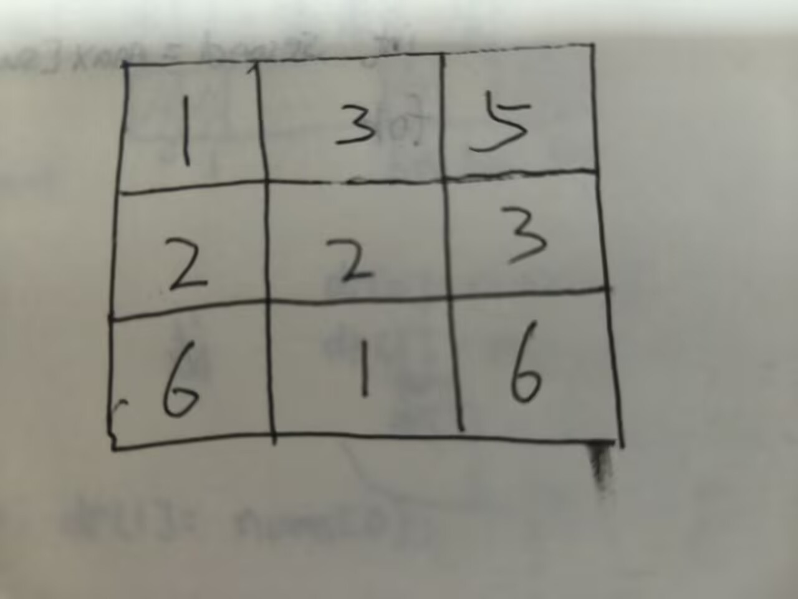
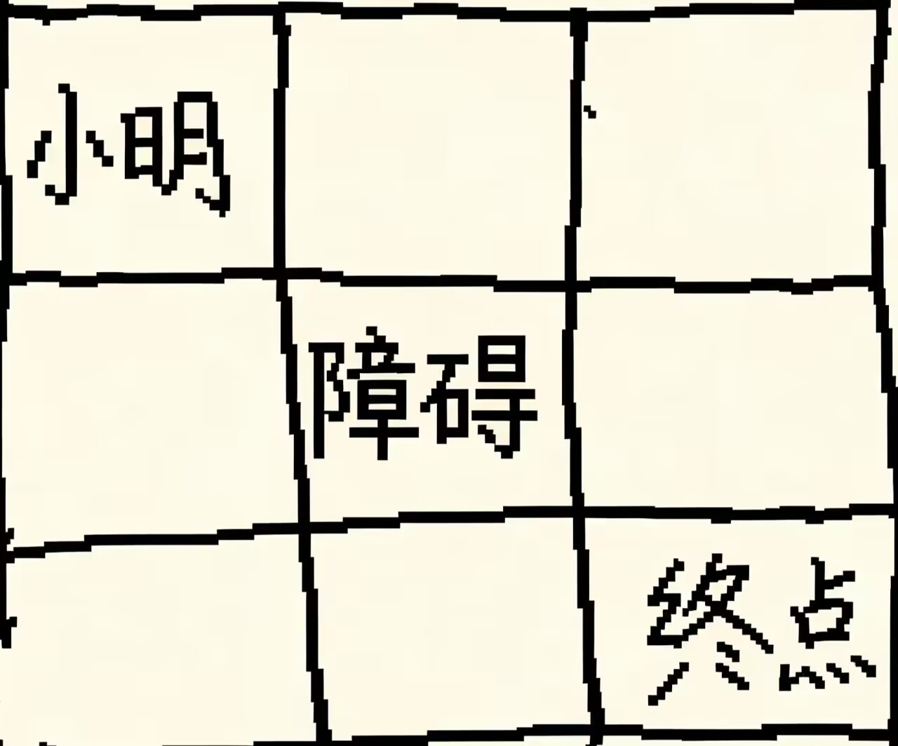
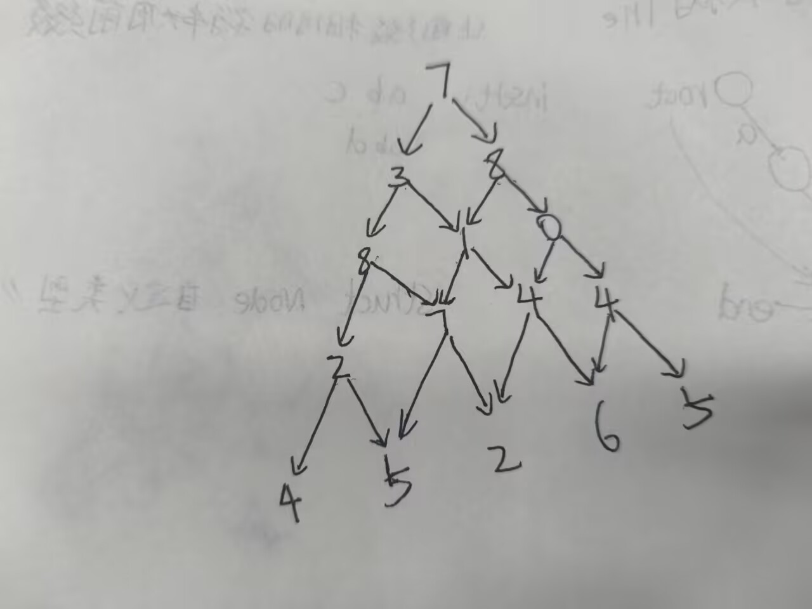

<h1 style="\\\*\\\*font-weight:bold; color:#222;\\\*\\\*">动态规划</h1>


动态规划一般是将一个问题分解成多个子问题，每个子问题的解可以独立计算，最后将所有子问题的解合并起来，得到问题的解。

我个人认为动态规划的思路比较抽象，需要多练习才能掌握。

最经典的动态规划问题就是01背包问题，但是我是从打家劫舍问题开始了解动态规划的。

<h1 style="\\\*\\\*font-weight:bold; color:#222;\\\*\\\*">打家劫舍问题：</h1>


你现在是一个专业的小偷，计划偷窃沿街的房屋。

每个房屋都藏有一定的现金，影响你偷窃的唯一因素就是相邻的房屋装有相互连通的防盗系统，

如果两间相邻的房屋在同一晚上被小偷闯入，系统会自动报警。

思路就是：现在有两种偷法：
```
{[ ][ ][ ][ ][ ].... [ ]  .  [ ] .  [ ]}假设一共k个房屋f(k)

  {0  1  2  3  4  ...        k-3   k-2   k-1 }
```
偷法1：

偷前k-1个房屋，最后一个房屋不偷。f(k-1)
```
{[/][/][/]....[/] . [/] . [/]  [ ]}

 { 0  1  2   ...  k-4  k-3 k-2  k-1  }
```
偷法2：

偷前k-2个房屋+最后一个房屋。f(k-2)+k-1
```
{[/][/][/]....[/] . [/] . [ ] . [ /]}

 { 0  1  2 ...    k-4  k-3 k-2  k-1  }
```
或许你没看懂

我给你举个例子：

假设k=4;

偷法1：f(3)

偷法2：f(2)+k-1

f(4)=max(f(3),f(2)+k-1)

那f(3)同理也是这么来的

偷法1：f(2)

偷法2：f(1)+k-1

f(3)=max(f(2),f(1)+k-1)

而f(2)也是这么来的

偷法1：f(1)

偷法2：0

f(2)=max(f(1),0)=f(1)

同理f(1)也是这么来的

偷法1：0

偷法2：0
f(0)=max(0,0)=0

这样你发现了这样的问题转化成多个子问题，每个子问题的解可以独立计算，最后将所有子问题的解合并起来，得到问题的解。

f(k)=max(f(k-1),f(k-2)+k-1)

也就是每次都在两种选法中选最大的那个；

代码实现：

这里我们假设一共n间房屋。
样例：

输入：

4

1 2 3 1

输出：

4
```cpp linenums="1" title="打家劫舍问题.cpp"
#include<bits/stdc++.h >
using namespace std;
int main(){
int n;
cin>>n;
vector<int> a(n+1,0);
for(int i=1;i<=n;i++){
    cin>>a[i];
}
vector<int>dp(n+1,0);
dp[0]=0;//因为没有房屋，所以金额为0；
dp[1]=a[1];//如果只有一个房屋，那么金额就是房屋的金额； 
  for(int i=2;i<=n;i++){
    dp[i]=max(dp[i-1],dp[i-2]+a[i]);
  }
  cout<<dp[n]<<endl;
return 0;
}
```

如果你觉得你理解了，那么我们来看他的进阶版（滚动版打家劫舍问题）
<h1 style="\\\*\\\*font-weight:bold; color:#222;\\\*\\\*">滚动版打家劫舍问题：</h1>

给你一个数组，数组中每个元素表示一个房屋的金额。但是如果你选择了偷其中的一间房屋（价值为a[i]），那么你需要放弃（删除）金额数为a[i]-1和a[i]+1的房屋。问在这样的情况下，你可以偷到的最大金额是多少？

这道题我个人在看的时候也联想不到打家劫舍，因为我找不到一个子问题，所以无法将问题分解成多个子问题。后来我通过“打家劫舍是不允许元素相邻”而这道题是不允许元素大小相邻”来写的。

```cpp linenums="1" title="滚动版打家劫舍问题.cpp"
#include<bits/stdc++.h>
using namespace std;
int main(){
int n;
cin>>m;
int maxn=0;
vector<int>nums(n);
for(int i=0;i<n;i++){
    cin>>nums[i];
    maxn=max(maxn,nums[i]);
}
vector<int>sum(n+1,0);
for(auto &i:nums){
  sum[i]+=i;
}
vector<int>dp(maxn+1,0);
dp[0]=sum[0];
dp[1]=max(sum[0],sum[1]);
for(int i=0;i<n;i++){
    dp[i]=max(dp[i-1],dp[i-2]+sum[i]);
}
cout<<dp[n-1]<<endl;
  return 0;
}
```
好的本喵来讲解一下喵:

这道题其实你把相同的数相加为一个数然后就变成了打家劫舍问题了

在此之前我们先讲一下auto &i:nums;的用法。

auto是c++11新增的，用于自动推导变量类型。

auto &i:nums的意思就是遍历nums数组中的每个元素，将每个元素赋值给i。

比如nums={2,2,3,3,4}

nums[2]=2+2;

nums[3]=3+3;

nums[4]=4;

这样我们就将nums里面相同的数相加为一个数。

为啥要相加呢？

还是例子nums={2,2,3,3,4}

相同元素相加后我们得到了一个新的数组我们记作sum={4,6,4}

这个时候就能看出来和前面的打家劫舍问题是一样的。

maxn是为了确定dp数组的大小。dp数组的大小要大于等于nums数组的最大值。否则会数组越界。


<h1 style="\\\*\\\*font-weight:bold; color:#222;\\\*\\\*">不同路径问题：</h1>

你现在位于一个m x n 网格的左上角。
你只能向下或向右移动一步。问有多少条不同的路径可以到达网格的右下角？

<div style="text-align:center;">
</div>


```cpp linenums="1" title="不同路径问题.cpp"
#include<bits/stdc++.h>
using namespace std;
int main(){
    int n,m;
    cin>>n>>m;
    vector<vector<int>> v(n,vector<int>(m));
    for(int i=0;i<n;i++){
        v[i][0]=1;
    }
    for(int i=0;i<m;i++){
        v[0][i]=1;
    }
       for(int i=1;i<n;i++){   
         for(int j=1;j<m;j++){   
            v[i][j]=v[i-1][j]+v[i][j-1];
        }
       } 
        cout<<v[n-1][m-1]<<endl;       
    return 0;
}


```
本喵来讲解一下一下喵:
因为我们只能向下或向右移动一步，因此我们的当前这一步是由上一步和左一步得到的。

因此可以写出关键的转移方程：

v[i][j]=v[i-1][j]+v[i][j-1];

初始化就是第一行和第一列都为1。因为从左上角到左上角只有1条路径。


<h1 style="\\\*\\\*font-weight:bold; color:#222;\\\*\\\*">最小路径和问题：</h1>

给定一个m x n 网格，你的任务是从网格的左上角到达网格的右下角，
并沿路径上的数字总和最小。

<div style="text-align:center;">
</div>

```cpp linenums="1" title="最小路径和.cpp"
#include<bits/stdc++.h>
using namespace std;
int main(){
    int m,n;
    cin>>m>>n;
    vector<vector<int>> grid(m+1,vector<int>(n+1,0));
    for(int i=1;i<=m;i++){
        for(int j=1;j<=n;j++){
            cin>>grid[i][j];
        }
    }  
    vector<vector<int>> dp(m+1,vector<int>(n+1,0));  
    dp[1][1]=grid[1][1];
    for(int i=2;i<=m;i++){
        dp[i][1]=dp[i-1][1]+grid[i][1];
    }
    for(int j=2;j<=n;j++){
        dp[1][j]=dp[1][j-1]+grid[1][j];
    }
    for(int i=2;i<=m;i++){
        for(int j=2;j<=n;j++){
                dp[i][j]=grid[i][j]+min(dp[i-1][j],dp[i][j-1]);
            }
        }
    
    cout<<dp[m][n]<<endl;
    return 0;
}

```
本喵来讲解一下一下喵:
因为我们只能向下或向右移动一步，因此我们的当前这一步是由上一步和左一步得到的。

因此可以写出关键的转移方程：

dp[i][j]=grid[i][j]+min(dp[i-1][j],dp[i][j-1]);

这个的意思就是当前这一步的路径和等于当前这一步的数字加上上一步和左一步的路径和的较小值。

也就是在左一步和上一步中选择较小的数然后加上当前的这一步数。

<h1 style="\\\*\\\*font-weight:bold; color:#222;\\\*\\\*">最小路径和问题：</h1>

给定一个m x n 网格，你的任务是从网格的左上角到达网格的右下角，
并沿路径上的数字总和最小
<h1 style="\\\*\\\*font-weight:bold; color:#222;\\\*\\\*">不同路径问题2：</h1>

给定一个m x n 网格，小明的任务是从网格的左上角到达网格的右下角，
但是网格中有一些障碍物，你不能通过障碍物。
小明想知道有多少条不同的路径可以到达网格的右下角？

网格中1为障碍物，0为无障碍物。

<div style="text-align:center;">
</div>

```cpp linenums="1" title="不同路径问题2.cpp"
#include<bits/stdc++.h>
using namespace std;
int main(){
    int m,n;
    cin>>m>>n;
    vector<vector<int>>grid(m,vector<int>(n));
    for(int i=0;i<m;i++){
        for(int j=0;j<n;j++){
            cin>>grid[i][j];
        }
    }
    vector<vector<int>>dp(m,vector<int>(n,0));
    dp[0][0]=1;
    for(int i=1;i<m;i++){
        if(grid[i][0]==0){
            dp[i][0]=dp[i-1][0];
        }
    }
    for(int j=1;j<n;j++){
        if(grid[0][j]==0){
            dp[0][j]=dp[0][j-1];
        }
    }
    for(int i=1;i<m;i++){
        for(int j=1;j<n;j++){
           if(grid[i][j]==1){
               continue;
           }else{
            dp[i][j]=dp[i-1][j]+dp[i][j-1];
           }    
        }
    }
    cout<<dp[m-1][n-1]<<endl;
    return 0;
}
        
```
这个和不同路径问题1的区别在于，这个题目中网格中有一些障碍物，我们不能通过障碍物。
当我们遇到障碍物时，我们跳过这次循环即可。


<h2>数字金字塔问题：</h2>

<p>给你一个数字金字塔，你的任务是从顶部的数字开始，每次移动到下一行的相邻数字上，
并沿路径上的数字总和最大。</p>
<div style="text-align:center;">
</div>

这题可以正着写也可以反着写。

```cpp linenums="1" title="数字金字塔.cpp"
#include<bits/stdc++.h>
using namespace std;

int main(){
    int n;
    cin>>n;
    vector<vector<int>> grid(n,vector<int>(n));
    for(int i=0;i<n;i++){
        for(int j=0;j<=i;j++){
            cin>>grid[i][j];    
        }
    }
    for(int i=n-2;i>=0;i--){
        for(int j=0;j<=i;j++){
            grid[i][j]+=max(grid[i+1][j],grid[i+1][j+1]);
        }
    }
    cout<<grid[0][0]<<endl;
    return 0;
}

```


