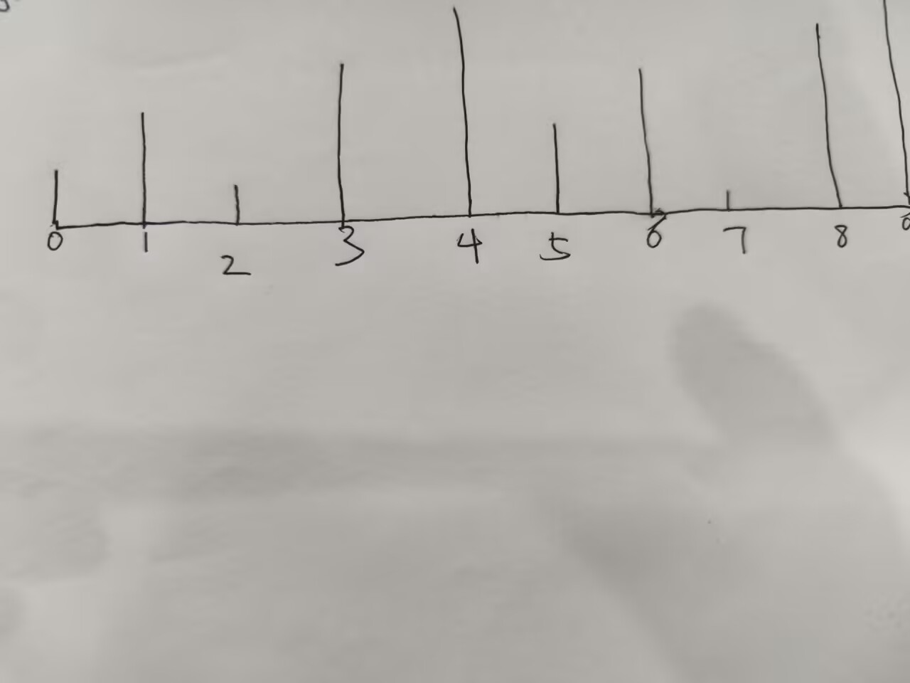

贪心算法跟他的名字一样，就是在局部内去求最优解。而不是考虑全局最优解。

贪心算法的基本思想是：每次选择当前最优解，而不是全局最优解。

最经典的贪心算法是：01背包问题。

当然它也属于动态规划的一种特殊情况。

<h1 style="\\\*\\\*font-weight:bold; color:#222;\\\*\\\*">01背包问题：</h1>

给你n件物品，每件物品有一个重量和一个价值。

你有一个背包，背包的容量是v。

问：

你最多能装多少价值的物品？

你只能装一次。你不能装半件物品。

代码实现：
```cpp linenums="1" title="01背包问题.cpp"
#include<bits/stdc++.h>
using namespace std;
int main(){
    int n,v;
    cin>>n>>v;
    vector<int>weight(n),value(n);
    for(int i=0;i<n;i++){
        cin>>weight[i]>>value[i];
    }
    vector<int>dp(v+1,0);
    for(int i=0;i<n;i++){
        for(int j=v;j>=weight[i];j--){
            dp[j]=max(dp[j],dp[j-weight[i]]+value[i]);
        }
    }
    cout<<dp[v]<<endl;
    return 0;
}
```
我们再来看一下部分背包问题：

现在在你面前有N堆金币，每堆金币有一个重量和一个价值。
你有一个背包，背包的容量是v。但是不一定有办法将全部的金币都装进背包。
但是现在你肯定想尽可能地装走多价值的金币。所有金币可以随意分割。分割完的
金币重量价值比不变。问最多能带走多大价值的金币？

输入：

第一行两个整数n和v，分别表示金币的数量和背包的容量。
第二行n行，每行两个整数，分别表示金币的重量和价值。

输出：

一个实数答案保留两位位小数。


<h1 style="\\\*\\\*font-weight:bold; color:#222;\\\*\\\*">盛最多水的容器：</h1>


<div style="text-align:center;">
</div>


给你n个长度不一的木棍，现在要求你选择两条使他们构成一个矩形，要求这个矩形盛的水是最多的。

这道题可以用双指针法来解决，也可以用暴力法来解决。

这个图只能先这样将就看了，我没办法去花时间构建一个好看的图，只能手绘了。

暴力循环：
```cpp linenums="1" title="盛最多水的容器.cpp"
#include<bits/stdc++.h>
using namespace std;

int main(){
int n;
cin>>n;
vector<int>v(n+1);
for(int i=1;i<=n;i++){
cin>>v[i];	
}
int maxn=0;
for(int i=1;i<=n;i++){
	for(int j=n;j>i;j--){
		maxn=max(min(v[i],v[j])*(j-i),maxn);
	}
}
cout<<maxn;	
}
```
这个用了双重循环，所以时间复杂度是O(n^2)。在一些严格的题目下，我们可能需要优化时间复杂度。不然会超时。

好的接下来我们用双指针法来解决。

顾名思义就是取左右两个指针，分别指向左右两个木棍。每次选择左右两个木棍中较短的那个，然后移动这个指针。直至遍历整个数组。

```cpp linenums="1" title="盛最多水的容器.cpp"
#include<bits/stdc++.h>
using namespace std;
int main(){
	int n;
	cin>>n;
	vector<int>v(n+1);
	for(int i=1;i<=n;i++){
		cin>>v[i];
	}
	int left=1;
	int right=n;
	int maxn=0;
while(right>left){
    int shu=min(v[left],v[right])*(right-left);
    maxn=max(maxn,shu);
	if(v[left]>=v[right])right--;
	else left++;	
	}
	cout<<maxn;
}
```
双指针好就好在只用一次循环，时间复杂度是O(n)。

<h1 style="\\\*\\\*font-weight:bold; color:#222;\\\*\\\*">跳跃问题：</h1>

输入n个正整数，表示n个位置的跳跃距离。你从第一个位置开始，每次跳跃距离最大是当前位置的数字。

问能否到达最后一个位置。

贪心思想就是我只考虑当前位置的跳跃距离，而不是全局最优解。

方案一：按照最远能到达的位置来判断的。

代码实现：
```cpp linenums="1" title="跳跃问题.cpp"
#include<bits/stdc++.h>
using namespace std;
int main(){
    int n;
    vector<int>nums(n);
    for(int i=0;i<n;i++){
        cin>>nums[i];
    }
    int reach=0;	
    for(int i=0;i<n;i++){
        if(i>reach)cout<<"false";
        reach=max(reach,i+nums[i]);
    }
    cout<<"true";
    return 0;
}

```
很好理解：
我们定义了一个reach指针，如果当前位置大于reach指针，那么说明我们不能到达当前位置。

我们每次选择当前位置的跳跃距离，然后更新reach指针。

<div style="text-align:center;">
</div>

方案二：按照最早开始的位置来判断的的。

解析一下：


```cpp linenums="1" title="跳跃问题.cpp"
#include<bits/stdc++.h>
using namespace std;

int main(){
    int n;
    cin>>n;
    vector<int>nums(n);
    for(int i=0;i<n;i++){
        cin>>nums[i];
    }
    int last=n-1;
    for(int i=n-2;i>=0;i--){
        if(i+nums[i]>=last)last=i;
    }
    if(last==0)cout<<"true";
    else cout<<"false";
    return 0;
}

```

<h1 style="\\\*\\\*font-weight:bold; color:#222;\\\*\\\*">跳跃问题2：</h1>
给定一个长度为n的数组nums，nums[i]表示你从位置i开始跳跃的最大距离。输出最小的跳跃次数。

```cpp linenums="1" title="跳跃问题2.cpp"
#include<bits/stdc++.h>
using namespace std;
int main(){
	int n;
	cin>>n;
    if(n==1)return 0;
	vector<int>nums(n);
	for(int i=0;i<n;i++){
		cin>>nums[i];
	}
	int reach=0;int shu=0;int end=0;
	for(int i=0;i<n;i++){
		reach=max(reach,nums[i]+i);
		if(i==end){
			shu++;
			end=reach;
			if(end>=n-1)
			break;
		}	
	}
	cout<<shu<<endl;
}
```
<div style="text-align:center; margin:20px 0;">
<video autoplay loop muted playsinline style="width:320px; max-width:100%; border-radius:8px;">
 <source src="../assets/shipin/咕咕嘎嘎.mp4" type="video/mp4">
</video>
</div>
作者快更新 ~~咕咕嘎嘎~~~