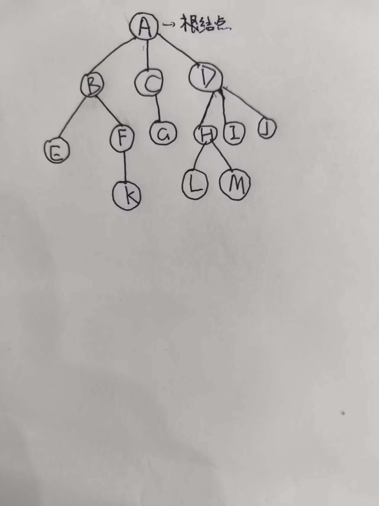
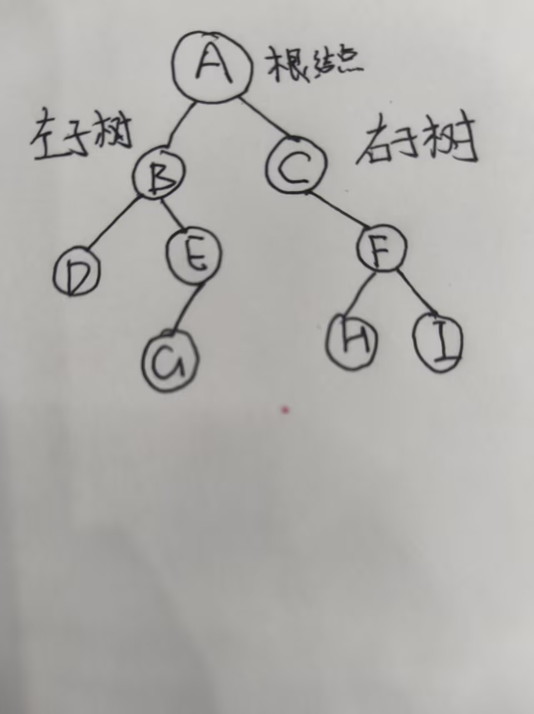
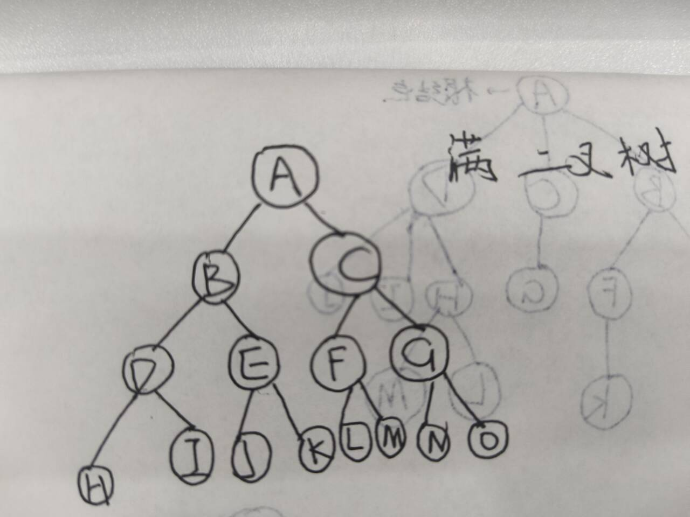
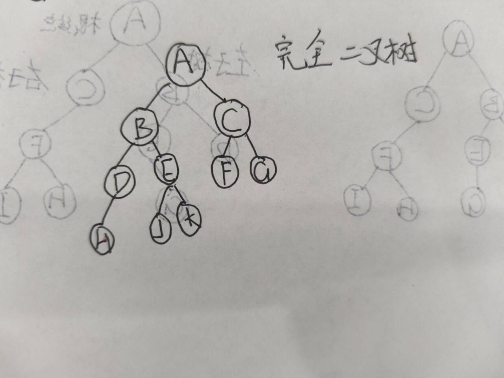

<h1 style="\\\*\\\*font-weight:bold; color:#222;\\\*\\\*">树：</h1>

在学习二叉树之前我们先了解一下树的基本概念。

树的定义：

n个节点构成的有限集合

n=0时，树为空树。

n>0时，树有且只有一个根结点。

每个子集也是树，被称为根结点的子树。

1.树的高度=树的深度=树的层数

2.结点的深度：他所在的层次

3.结点的高度：以他为根的子树的层数

4.结点的度：孩子的个数

5.叶结点：度为0的结点

6.分支结点：度大于0的结点

7.分支结点：度大于0的结点

树分为有序树和无序树。

各个节点的子树从左到右有次序，不能互换，称为有序树。否则称为无序树。

树的性质：

节点数n=边数+1=所有结点数之和+1

我们来了解二叉树。

二叉树：树中每个结点最多有两个分支的树。

下面我们认识一下两种特殊的二叉树。

1.满二叉树：每个结点都有两个子结点的二叉树。

满二叉树：所有分支结点都有两个子结点。所有叶结点都在最底层。只有度为0的结点和度为2的结点。

2.完全二叉树：每个结点都有两个子结点的二叉树。

完全二叉树：除了最后一层，其他层的结点都有两个子结点。最后一层的结点都从左到右连续排列。但是最后一层可以没有满。
