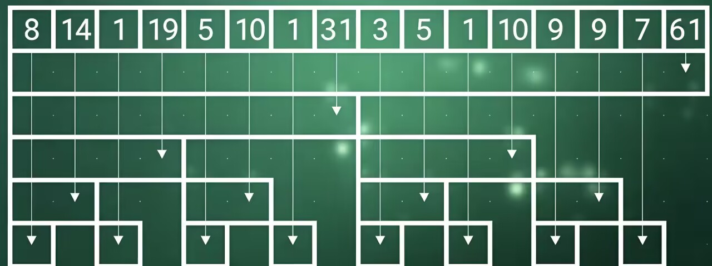

树状数组表面带着树但是和数据结构里面的树是不同的。
树状数组在处理数组数据时，效率是很高的。O(logn)
之所以叫他为树状数组，是因为他处理数据的方式类似于树状结构。
这里我来演示一下：

数组nums长度为16,nums={8,6,1,4,5,5,1,1,3,2,1,4,9,0,7,4};
我们想给定两个数a,b求a到b下标的和。如果我们使用前缀和去求，需要O(n)的时间复杂度。

这里我们就会想到如果将数组的数量减少一半循环遍历就少了一半效率是不是就提高了；
没错树状数组就利用了这个思想。
```
                      61

           31                     30

     19          12          10         20

 14     5    10      2     5      5     9     11  

8  6   1  4  5  5   1  1  3  2   1  4  9  0  7  4

```
我们这样一层一层的两两合并，就得到了树状数组。
比如说我们想求1-15的和
就只需要求31+10+9+7即可从原来的求15次循环减少到4次。

但是这还是有些复杂，我们观察到在这个树状数组图中，存在很多的数据我们求了但是我们不需要。
比如说下面第二行的5，
在我们计算前两个数的和时，我们用不到。
在计算前三个数的和时，我们用不到。
而在计算前四个前五个数的和时，我们用上面的19更合适。
因此这个数字没必要去使用。
像这样的数字还有很多所有层的第偶数个数字都是没用的，即使去掉也不影响计算。

去掉后：
```
             61

         31   

     19              10          

  14     10       5       9

8   1   5   1   3   1   9   7
```
观察剩下的数据，我们可以发现，剩下的数据整好有16个和原来的nums的长度是一样的
我们将这些数弄到一个新数组中。
nums2={8,14,1,19,5,10,1,31,3,5,1,10,9,9,7,61};
<div style="text-align:center;">
</div>
数组中的每一个元素，都对应下面每一个区间。而下面的每一个区间表示的是原数组的某个区间和。
求和时，我们只需要找到对应的区间，然后将这些区间相加即可。
修改某个数据时，我们也只需要向上找到包含他的区间进行修改即可。

```
void add(int p,int x){
    while(p<n){
        a[p]+=x;
        p+=lowbit(p);
    }
}
ll count(int p){
    ll res=0;
    while(p>0){
        res+=a[p];
        p-=lowbit(p);
    }
    return res;
}
```

接下来我们了解一下lowBit函数。

lowBit函数会求出一个二进制数字的最低位代表的数字。（取出一个二进制数字的最低位的1）

比如说1000110

lowBit函数会求出最低位的1，就是2。

比如说6

6的二进制表示为110

lowBit函数会求出最低位的1，就是2。

观察树状数组我们知道第一行数据，他们的区间长度为1。他们的序号对应的lowbit值就是1。

第二行数据，他们的区间长度为2。他们的序号对应的lowbit值就是2。

第三行数据，他们的区间长度为4。他们的序号对应的lowbit值就是4。

第四行数据，他们的区间长度为8。他们的序号对应的lowbit值就是8。

比如10对应数组的第12个元素。

12的二进制表示为1100

lowbit(12)就是4。

b[12]存放的是原来nums数组里，以12结尾，一共4个元素的和。

也就是nums[12]+nums[11]+nums[10]+nums[9]。

长度4=lowbit(12)

即序号为i的序列正好长度就是lowbit(i)，且这个序列的元素都是以i结尾的。

比如说我们要计算前14个元素的和。

14-lowbit(14)=12

只需要计算前12个元素的和加上b[14]即可。
```
ll count(int p){
    if(p==0){
        return 0;
    }
    return count(p-lowbit(p))+a[p];
}
```
如果一个序列b[i]，他的正上方的序列正好就是b[i+lowbit(i)]

所以当我们修改某个位置的值的时候只需要不断加上lowbit(i)就可以找到上方的所有序列，进行修改即可。
修改某个位置的值的函数：
```
void add(int p,int x){
    while(p<n){
        a[p]+=x;
        p+=lowbit(p);
    }
}
```
完整代码：
```
inline int lowbit(int x){
    return x&(-x);
}
void add(int p,int x){
    while(p<n){
        a[p]+=x;
        p+=lowbit(p);
    }
}
ll count(int p){
    ll res=0;
    while(p>0){
        res+=a[p];
        p-=lowbit(p);
    }
    return res;
}
```
树状数组1：

已知一个数列，你需要进行下面两种操作：

1.将某一个数加上x；

2.求出某区间每一个数的和。

输入格式：

第一行包含两个正整数n和m。
n表示数列的长度，m表示操作的次数。
m行，每行包含一个操作。

第二行包含n个正整数，表示数列的元素。
其中第i个元素表示数列的第i项的初始值。
接下来m行每行包含3个整数，表示一个操作。
具体如下：

1 x k 含义：将第x个数加上k。
2 x y 含义：输出区间[x,y]的和。

输出格式：

每个操作的输出占一行。

这个题他的要求是O(nlogn)
我们如果想用前缀和求区间和，我们需要O(n^2)的时间复杂度。

因为我们要写双重循环嘛。

所以这个题我们需要用树状数组。

```cpp 