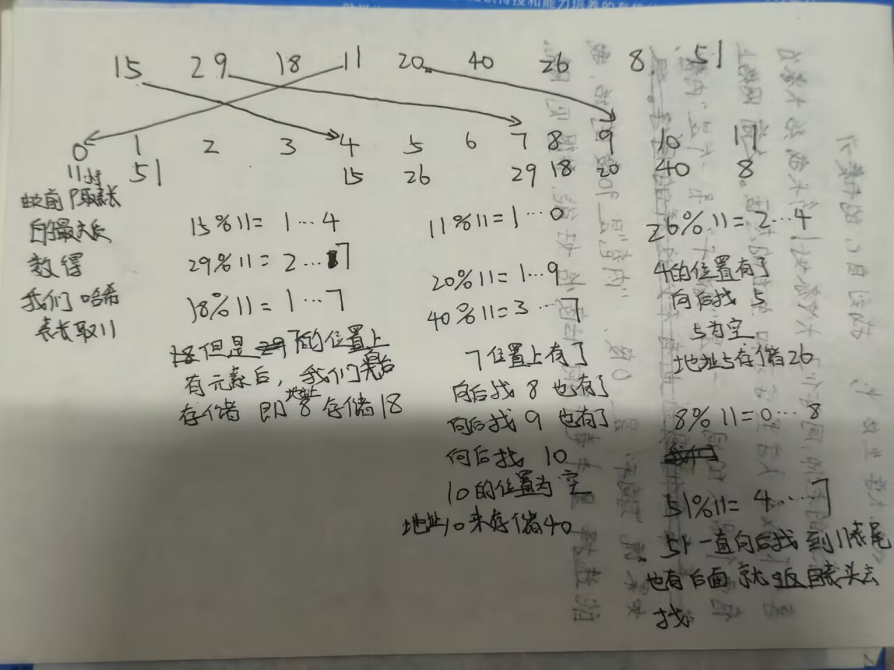
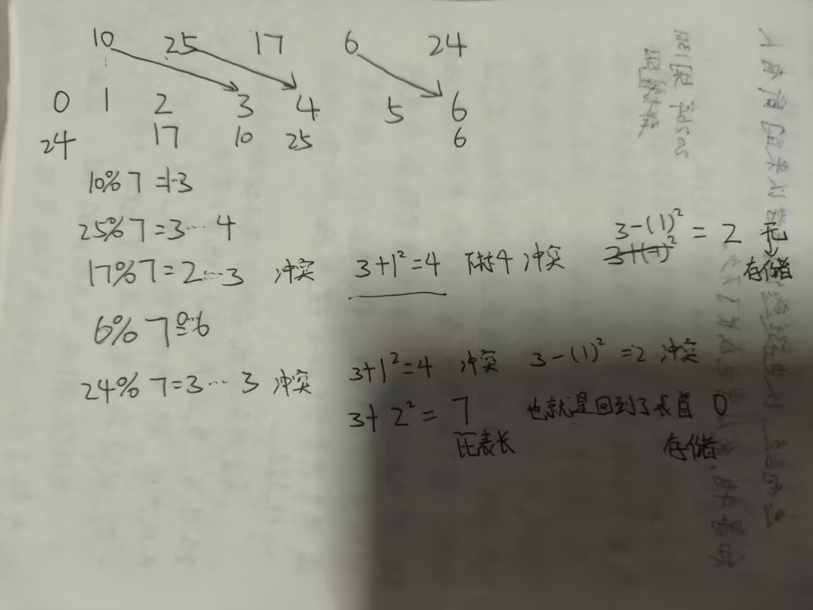
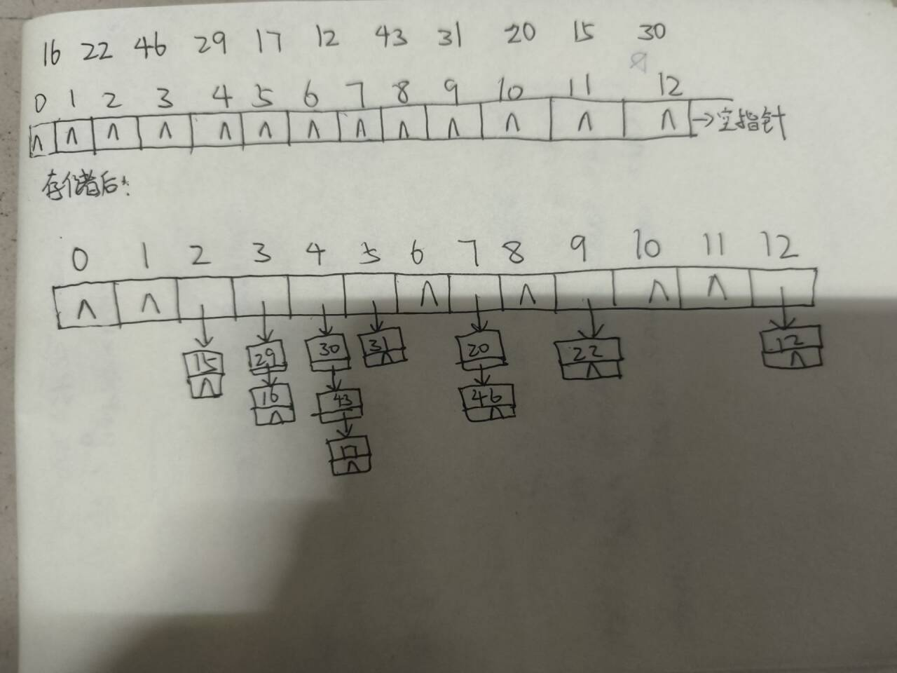

<h1 style="\\\*\\\*font-weight:bold; color:#222;\\\*\\\*">哈希查找</h1>
其实我很久之前就像写哈希查找了因为他其实好用也比较重要

我们首先了解一下哈希表的定义：

哈希表又称散列表，是一种基于键值对存储数据的数据结构。

如：
```
学号：姓名 ：           
 2     A
 3     B
 5     C
 1     D
 4     E
 0     F
```
我们现在要讲这些数据存储到哈希表中。

我们先讲一下直接地址法：

```
关键字（key）        【】【】【】              下标（地址）
                    【】【】【】
                      散列函数
                    【】【】【】
                    【】【】【】
```
比如说我们现在要存储100 101  102  103 104

我们现在要将这些数据存储到哈希表中。为了后续方便其他的一些操作我们让这些数和哈希表的下标对应起来。

此时我们可以通过散列函数将这些数和哈希表的下标对应起来。H(key)=key+100;

这时我们就可以将上面的数存储到哈希表中了。

```
0     1     2       3
100   101   102   103
```
但是我们在存储0 29 72 31 18 6 这些数的时候我们需要开到72个空间。中间大部分的空间浪费掉了。空间利用率是很低的。

下面我们换一种方法：

除留余数法：

H（key）=key%p;

p一般取小于等于表长的最大质数。

上面的我们就可以取p=7;

但是这里会出现一个问题：我们将数字存储在数组里面的时候，如果两个数字的余数相同，那么它们就会被存储到同一个位置。

```
关键字1：->      散列     ->      同一
关键字2：->      函数     ->      地址
```
我们称这种为同义词。

冲突会影响哈希表的效率。要尽可能地避免冲突。

解决冲突有两种方法：

1.开放定址法

2.拉链法

我们先说一下开放定址法：

开放定址法的思想就是：我们再找一个新的位置去存放冲突的元素。

有两种方法：

1.线性探测法

2.二次探测法

其实这两种都差不多

我们先了解一下线性探测法：

线性探测法的思想就是：我们从冲突的位置开始，向后探测，直到找到一个空的位置。表位的下一位置是表首。

直接上例子吧：

<div style="text-align:center;">
</div>

同理我们如果想去查找元素就要用相同的办法

如我要查找 8

我们先8%11=0……8

我们到下表为8的位置找发现为18不是向后找下标9为20还不是再找下标10为40还不是再找下标11为8。

最终找到。

如果找到的位置是空的代表元素不在哈希表中。

下面我们介绍二次探测法：

二次探测法的思想就是：我们从冲突的位置开始，向后探测，直到找到一个空的位置。表位的下一位置是表首。

他和线性探测法的区别就是：线性探测法是一个一个探测，二次探测法是跳着探测。

当然是有规则的探测一般是按照：+1^2  -1^2  +2^2  -2^2  +3^2  -3^2  ...

我们称之为跳跃式探测。

优点：可以缓解堆积的问题。

缺点：不一定能探测到所有散列表位置。

表长如果是某个4K+3的质数（k为正整数）那么一定可以探测到所有位置。

这里我们依旧上例子吧：

<div style="text-align:center;">
</div>

同理我们如果想去查找元素就要用相同的办法

提醒：如果我们用开放定址法去删除表中的元素，我们是不能直接删除的。；因为会影响后面的查找。

这时候就需要我们用一个特殊标志位去表示这个位置被删除了。一般使用NULL。

最后我们来介绍一下拉链法：

这个的思想就是把冲突的元素都放到一个链表中串起来。

每个哈希表的位置都包括一个头指针，相当于一个个的单链表。

依旧上例子吧：

<div style="text-align:center;">
</div>

这个就是线性表的性质先进后出。

遇到空指针就是查找失败。

拉链法可以直接删除元素。

上面只是哈希表和哈希表存储和查找的基本操作。

下面我们还是来一题吧：

```cpp title="哈希表"
#include<bits/stdc++.h>
using namespace std;
const int SIZE = 11;
const int EMPTY = -1;
const int DEL = -2;
int hashTable[SIZE];

void init() {
    for(int i = 0; i < SIZE; i++)
        hashTable[i] = EMPTY;
}

// 插入
bool insert(int key) {
    int addr = key % SIZE;
    for(int i = 0; i < SIZE; i++) {
        if(hashTable[addr] == EMPTY || hashTable[addr] == DEL) {
            hashTable[addr] = key;
            return true;
        }
        addr = (addr + 1) % SIZE;
    }
    return false; // 表满
}

// 查找，返回下标，失败返回-1
int search(int key) {
    int addr = key % SIZE;
    for(int i = 0; i < SIZE; i++) {
        if(hashTable[addr] == EMPTY) return -1;
        if(hashTable[addr] == key) return addr;
        addr = (addr + 1) % SIZE;
    }
    return -1;
}

// 删除：只打删除标记，不清空
bool remove(int key) {
    int pos = search(key);
    if(pos == -1) return false;
    hashTable[pos] = DEL;
    return true;
}

void printTable() {
    for(int i = 0; i < SIZE; i++)
        cout << "[" << i << "] = " << hashTable[i] << endl;
}

int main() {
    init();
    int arr[] = {20, 18, 29, 30, 42};
    int n = sizeof(arr)/sizeof(arr[0]);
    for(int i = 0; i < n; i++) insert(arr[i]);

    printTable();
    int pos = search(42);
    if(pos != -1) cout << "\n找到42，下标：" << pos << endl;
    remove(20);
    cout << "\n删除20后：" << endl;
    printTable();
    return 0;
}
```
下面我们介绍一下unordered_map,unordered_set。

这两个容器都是基于哈希表实现的。这两个容器映射的本质就是除留余数法

这两个容器处理冲突的方法就是拉链法。

unordered_set是一个无序的集合容器。

初始化：
```
unordered_set<int>s;
```
插入：
```
s.insert(100);
s.insert(101);
s.insert(101);//重复插入，自动忽略。
```
查询：
```
if(s.count(1)){}//存在返回1，不存在返回0。

if(s.find(1)!=s.end()){}//存在返回迭代器，不存在返回end()。
```
删除：
```
s.erase(1);
```
遍历：
```
for(int x:s){
    cout<<x<<endl;
}
```
unordered_map是一个无序的映射容器。

初始化：
```
unordered_map<int,int>mp;
```

去重+快速查找用unordered_set。

哈希映射（计数、统计）用unordered_map。

必须有序用set,map。

插入：insert

删除：erase

查询：count、find

大小：size()

清空：clear

遍历：
```
for(auto x:mp){
    cout<<x.first<<" "<<x.second<<endl;
}
```
<h2>鸭梨一只蓝色大肥鱼</h2>

<div style="text-align:center;">
</div>


<p>蓝色大肥鱼正在消耗你的token，现在给一个数n，后面n行一行给出一对数。</p>
<p>这两个数两两对应。</p>
<p>后面给出m行数，每行给出一对数。</p>
<p>如果这两个数对应，那么就输出“大肥鱼有用”，否则输出“鸭梨大肥鱼”。</p>


样例：
```
2
111111111 222222222
333333333 444444444
4
666666666 888888888
222222222 111111111
222222222 333333333
333333333 444444444
```
```
鸭梨大肥鱼
大肥鱼有用
鸭梨大肥鱼
大肥鱼有用
```

```cpp linenums="1" title="鸭梨一只蓝色大肥鱼"
#include<bits/stdc++.h>
using namespace std;

typedef long long ll;
int main(){
	int n;
	cin>>n;
	unordered_map<ll,ll>mp;
	 for(int i=0;i<n;i++){
	 	ll a,b;
	 	cin>>a>>b;
	 	mp[a]=b;
	 	mp[b]=a;
	 }
	 int m;
	 cin>>m;
	 while(m--){
	 	ll x,y;
	 	cin>>x>>y;
	 	if(mp.count(x) && mp[x]==y)
	 		cout<<"大肥鱼有用"<<endl; 
		 else 
		 cout<<"鸭梨大肥鱼"<<endl; 
	 }
	 return 0; 
}
```
这里面我们用哈希容器unordered_map来存储映射关系。

用mp[a]=b; mp[b]=a; 来存储映射关系。mp[键]=值。

mp.count(x)判断x是否存在。