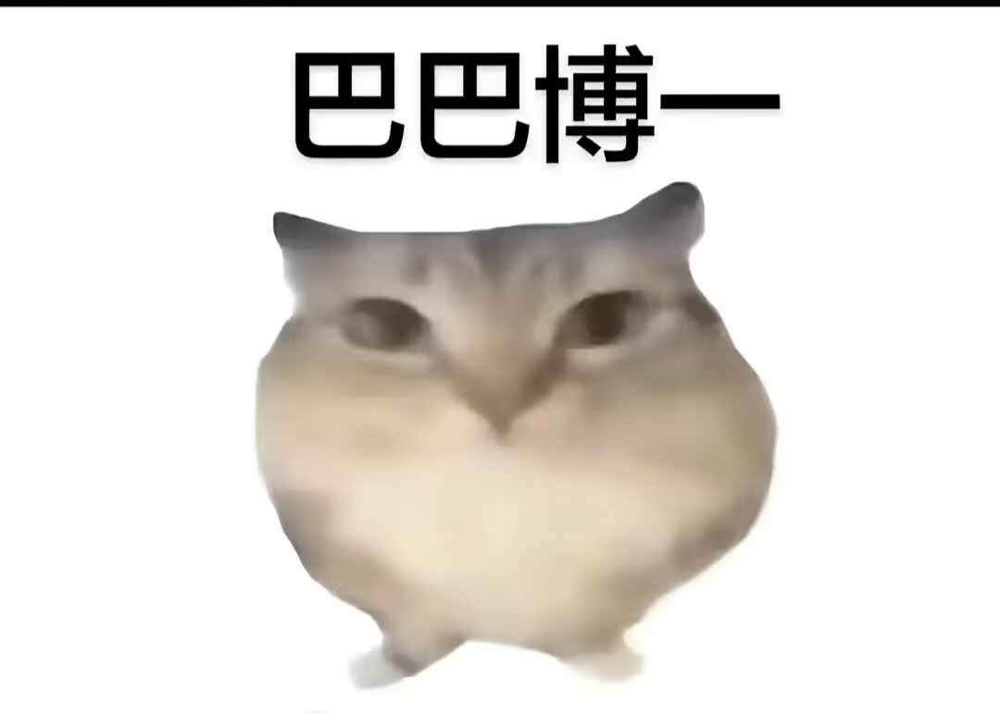
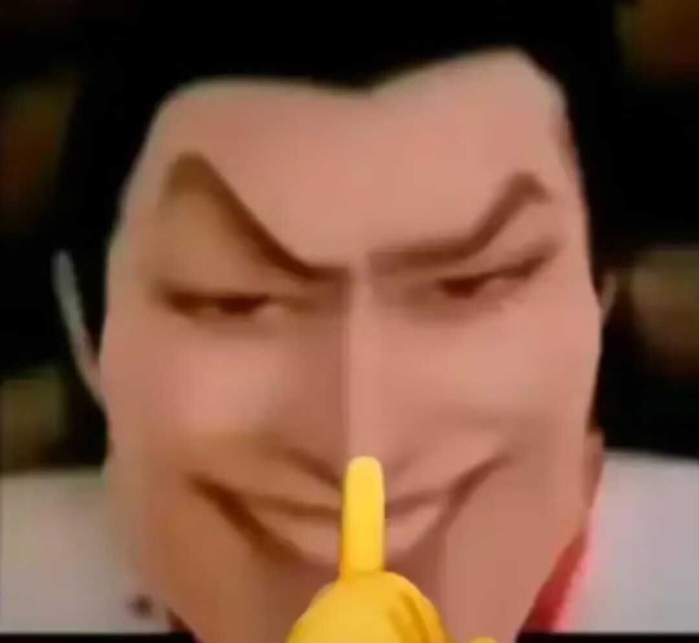

巴什博弈：
<div style="text-align:center;">
</div>


题干是这样的：

小喵和大狗在玩一个游戏，游戏规则如下：

现在有n个石头，小喵和大狗轮流从石头中取走1-m个石头，谁取走最后一个石头的人就是赢家。

小喵先取。

如果小喵赢了小喵会高兴输出：“老鼠洗完头”；

如果大狗赢了小喵会难过输出：“泥肘”；

这是一道博弈论问题。很经典的巴什博弈

如果n%(1+m)=0，那么后手赢。

如果n%(1+m)!=0，那么先手赢。

<div style="text-align:center;">
</div>


```cpp title="巴什博弈代码"
#include<bits/stdc++.h>
using namespace std;

int main()
{
    int n,m;
    cin>>n>>m;
    if(n%(1+m)==0)
    {
        cout<<"泥肘"<<endl;
    }
    else
    {
        cout<<"老鼠洗完头"<<endl;
    }
    return 0;
}
```
作者温馨提示：

题需慢慢写，心急则泥肘。

<div style="text-align:center;">
</div>

<h2>摩尔投票法</h2>
<p>我们介绍一种算法摩尔投票法。</p>

<p>这个算法实现的前提是数据中的一个元素的数量大于全部元素的数量的一半。</p>

这个算法的思想就是：

我们把一个最多的元素作为候选元素。其他的合并为一个元素。

比如说：
```
1 2 2 3 2 2
```
这里我们先取第一个元素作为候选元素。

此时候选人为：1 票数为1。

后面出现2 不为1，所以票数减1。

票数为0，所以选人为2。

后面2出现，所以票数加1。

也就是利用这种思想，我们就可以找到一个最多的元素。

经典问题：

<h2>白鼠试药</h2>
<div style="text-align:center;">
</div>

现在有100瓶药，99瓶是无毒的，1瓶是有毒的。外观一致。问至少需要试多少只白鼠才能确定毒药的位置？

<p>这个就是利用二进制思想。</p>

1的二进制表示为：00001

2的二进制表示为：00010

3的二进制表示为：0011

4的二进制表示为：01000

……  ……  ……   ………

100的二进制表示为：1100100

<h3>也就是需要7只白鼠。</h3>

为啥？

1号毒药喂给第1只白鼠。

2号毒药喂给第2只白鼠。

3号毒药喂给第1，2只白鼠。

4号毒药喂给第3只白鼠。


100号毒药喂给第3，6，7只白鼠。

如果那只白鼠死了记为1，否则记为0。

如果白鼠7，6 ，3死了其他还活着

1100100转化为10进制为：100

100号是毒药。

