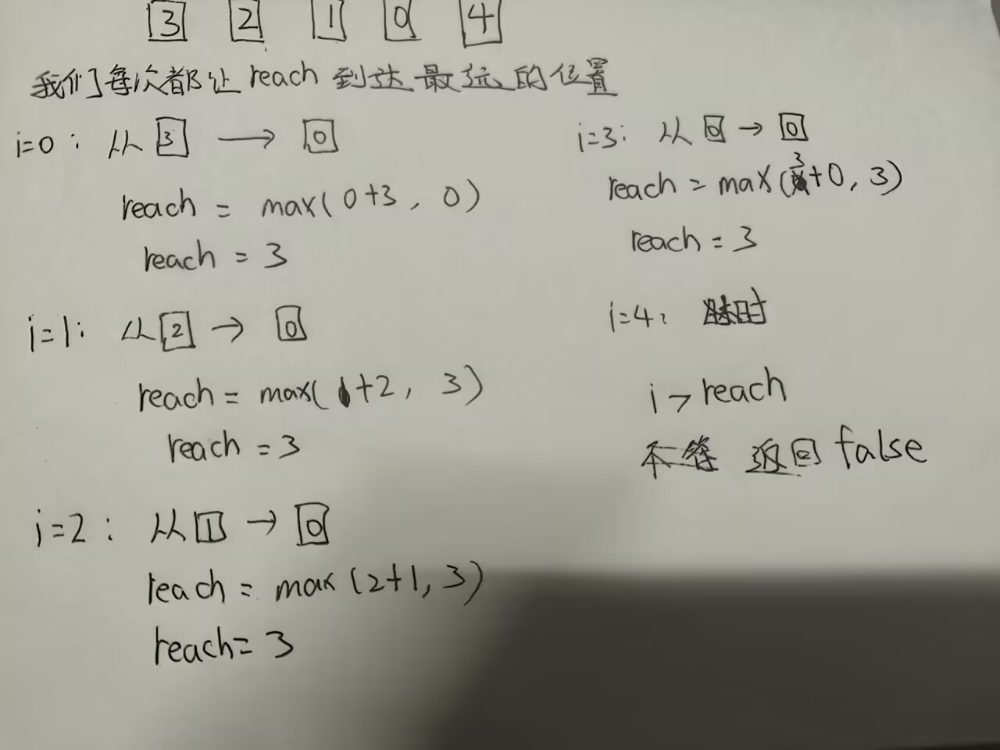

<h1 style="\\\*\\\*font-weight:bold; color:#2563eb\\\*\\\*;">前缀和与差分</h1>
前缀和顾名思义就是求数组的前缀和

前缀和的定义是，对于一个数组 nums，前缀和数组 prefixSum 的第 i 个元素表示原数组从索引 0 到索引 i 的所有元素的和。

具体来说，前缀和数组 prefixSum 的计算公式如下：
```
sum[i]=sum[i-1]+arr[i]
```
解释一下公式：
arr 是你要求和的数组
sum是前缀和数组，它的第i个元素表示原数组从索引0到索引i的所有元素的和
```
arr 1        3         7            5              2
sum 1   (1+3)4  (1+3+7)11  (1+3+7+5)16  (1+3+7+5+2)18
```
<div style="text-align:center;">
</div>

前缀和公式：

```
sum[i]=sum[i-1]+arr[i]   i>0;
sum[0]=arr[0]   i=0;
sum[L,R]=sum[R]-sum[L-1]   L<=R
sum[L,R]=sum[R]   L=0
```
我们来一道基础的前缀和的题：
<h1 style="\\\*\\\*font-weight:bold; color:#222;\\\*\\\*">求区域和：</h1>
n个数组成的数组nums要求求出数组中从索引L到R的所有元素的和。
输入：一个整数表示数组长度，后面输入n个元素a和b表示求和区域
输出：一个整数表示从索引L到R的所有元素的和

```cpp linenums="1" title="求区域和.cpp"
#include<bits/stdc++.h>
using namespace std;
int main(){
	int n;
	cin>>n;
	vector<int>nums(n);
	for(int i=0;i<n;i++){
		cin>>nums[i];
	}
	vector<int>sum(n);
	for(int i=1;i<n;i++){
		sum[0]=nums[0];
		sum[i]=sum[i-1]+nums[i];
	}
	for(int i=0;i<n-1;i++){
		int a,b;
		cin>>a>>b;
		int res;
		if(a==0)sum[b-a]=sum[b];
		else
		res=sum[b]-sum[a-1];
		cout<<res<<" ";
	}	
	return 0;
}
```


<h1 style="\\\*\\\*font-weight:bold; color:#222;\\\*\\\*">长度最小的子数组：</h1>

n个数组成的数组nums要求找到一个子数组，使得子数组的和大于等于目标值target，且子数组的长度最小。

其实这个并不是一道很合适的前缀和问题。

应为她对于初学者是比较难的；而简单的方法又用不到前缀和。

这里我会展示两种方法。

第一种方法是用滑动窗口。

第二种方法是用前缀和+二分查找。

其实我最开始的时候是没看清题目以为可以打乱数组的顺序，当时还在想这题不就是简单的排序一下吗
和前缀和有啥关系。但是后来样例没通过我才明白不能改变数组顺序。

方法一：

```cpp linenums="1" title="长度最小的子数组.cpp"
#include<bits/stdc++.h>
using namespace std;
int main(){
int target,n;
cin>>target>>n;
vector<int>nums(n);
for(int i=0;i<n;i++){
    cin>>nums[i];
}
int left=0;
int sum=0;
int minlen=n+1;
for(int right=0;right<n;right++){
sum+=nums[right];	

	while(sum>=target){
		minlen=min(minlen,right-left+1);
		sum-=nums[left]	;
		left++;
	}
}
if(minlen==n+1)cout<<"0"<<endl;
else cout<<minlen<<endl;
    return 0;
}
```
我来简单解释一下：
当sum的值小于target时，我们继续向右移动right指针，将nums[right]加入sum中。

当sum的值大于等于target时，我们更新minlen，将nums[left]从sum中减去，同时将left指针向右移动。

然后让minlen去存储这个过程中符合条件的最小长度。

方法二：

```cpp linenums="1" title="长度最小的子数组.cpp"
#include<bits/stdc++.h>
using namespace std;

int main(){
    int target,n;
    cin>>target>>n;
    vector<int>nums(n);
    for(int i=0;i<n;i++) cin>>nums[i];

    vector<int>pre(n+1,0);
    for(int i=0;i<n;i++) pre[i+1]=pre[i]+nums[i];

    int minLen = n+1;
    for(int r=1;r<=n;r++){
        int want = pre[r] - target;
        auto it = upper_bound(pre.begin(),pre.begin()+r, want);
        int l = it - pre.begin();
        if(l < r){
            minLen = min(minLen, r-l);
        }
    }
    if(minLen == n+1) cout<<0;
    else cout<<minLen;
    return 0;
}
```

<h1 style="\\\*\\\*font-weight:bold; color:#222;\\\*\\\*">除了自身意外数组的乘积：</h1>


给定n个数字，返回数组ans，其中ans[i]表示nums数组中除了nums[i]以外的所有元素的乘积。

题目数据保证数组乘积不会溢出32位整数。

请不要使用除法。且在O(n)时间复杂度内完成。


题目里面的要求已经很明确了。
其实如果你能想到除法就已经 说明你会从反面看待问题了。
但是样例里面可定会有0的情况。而且要求了不能用除法。

这里我们可以用前缀积和*后前缀积，来求。

前缀乘积：
```
nums 2         4          1          3          5
ans  1   （1*2）2   （2*4）8   （8*1）8   （8*3）24
```
由此我们观察到前缀乘积的公式为：
```
ans[i]=ans[i-1]*nums[i-1]
```
后缀乘积：
求后缀乘积的时候，我们需要从后往前求。
```
nums        2                4                1          3          5
ans (4*15) 60          (1*15)15          (3*5)15    (1*5)5          1
```
由此我们观察到后缀乘积的公式为：
```
ans[i]=ans[i+1]*nums[i+1]
```
最后我们把前缀乘积和后缀乘积相乘，就是我们要求的ans数组。
```
ans[i]=ans[i-1]*ans[i+1]
```
代码实现：

```cpp linenums="1" title="除了自身意外数组的乘积.cpp"
#include<bits/stdc++.h>
using namespace std;

int main(){
	int n;
	cin>>n;
	vector<int>nums(n);
	for(int i=0;i<n;i++){
		cin>>nums[i]; 
	} 
	vector<int>ans(n,1);
	for(int i=1;i<n;i++){
		ans[i]=ans[i-1]*nums[i-1];
	}
	vector<int>shu(n,1);
	for(int i=n-2;i>=0;i--){
		shu[i]=shu[i+1]*nums[i+1];
	}
	for(int i=0;i<n;i++){
		cout<<shu[i]*ans[i]<<" ";
		
	}

	return 0;
}
```
但是这个方法的时间复杂度是O(n)，空间复杂度是O(3n)。因为我们需要开三个数组。
但是我们可以优化空间复杂度，只开一个数组。
```cpp linenums="1" title="除了自身意外数组的乘积2.cpp"
#include<bits/stdc++.h>
using namespace std;

int main(){
	int n;
	cin>>n;
	vector<int>nums(n);
	for(int i=0;i<n;i++){
		cin>>nums[i]; 
	} 
	vector<int>ans(n,1);
	for(int i=1;i<n;i++){
		ans[i]=ans[i-1]*nums[i-1];
	}
	int right=1;
	for(int i=n-1;i>=0;i--){
	ans[i]=ans[i]*right;
	right=nums[i]*right;
	}
	for(int i=0;i<n;i++){
		cout<<ans[i]<<" ";
	}

	return 0;
}
```
解释一下：我们用了一个变量right，来表示后缀乘积。

```
nums        2                 4                1          3          5
right(4*15) 60          (1*15)15          (3*5)15    (1*5)5          1
```

