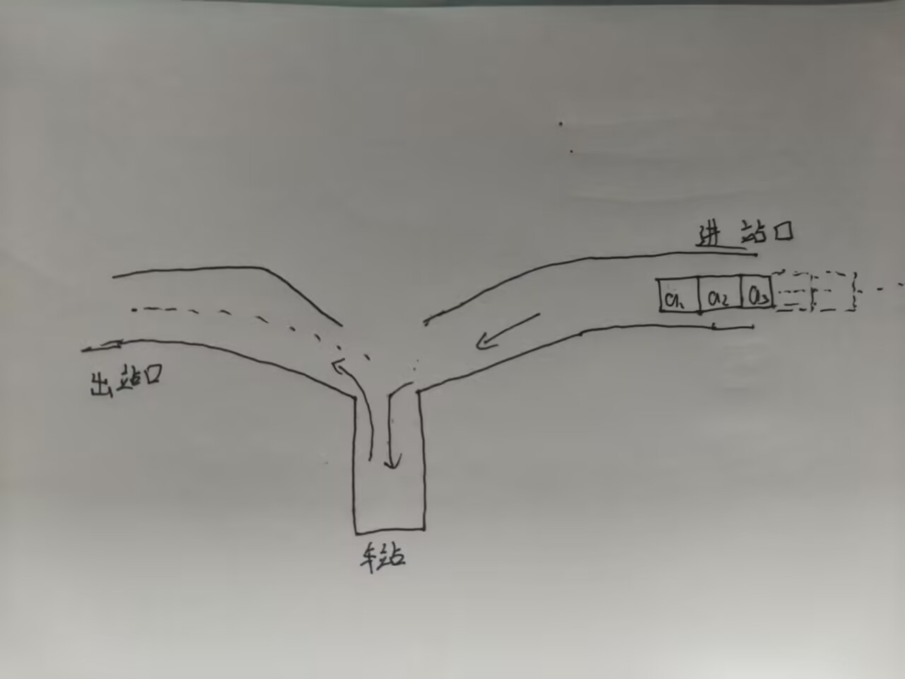

其实我本来是想在stl容器里写栈，队列和堆的，但是数据结构里面更详细一点

stack（栈）是一个先进后出的容器，他仅仅维护栈顶，支持入栈（push），查询栈顶元素（top）和出栈（pop）以及查询大小（size）和是否为空（empty）等操作。
```cpp linenums="1" title="stack.cpp"
stack<int>res;//创建一个空栈，栈不允许列表初始化或填充相同的元素。但是可以从已有的栈进行拷贝。

如：stack<int>res2(res);
```
入栈：
```cpp linenums="1" title="stack.cpp"
1.res.push(10)//res=[10(top)]输入

2.res.push(20)//res=[20(top),10]输入

3.res.push(0)//res=[0(top),20,10]输入

4.cout<<res.top();//输出0

5.res.pop();//res=[20(top),10]

6.cout<<res.top();//输出20
```
接下来我们取出栈顶元素。

在c++中，top()函数仅仅是取出栈顶元素，不会将栈顶元素pop()掉。

```cpp linenums="1" title="stack.cpp"
7.cout<<res.top();//输出20
```
接下来我们出栈。

在弹出栈顶元素时，注意栈为空的情况。
如果栈为空，不能弹出栈顶元素。

现在栈里面只有20和10。20是栈顶元素。

```cpp linenums="1" title="stack.cpp"
8.if(res.size())res.pop();

9.cout<<res.top();//输出10  
```
接下来我们获取栈的大小。

现在栈里面只有10。

```cpp linenums="1" title="stack.cpp"
10.cout<<res.size();//输出1
```

```cpp linenums="1" title="stack.cpp"
11.if(res.empty())cout<<"栈为空"<<endl;//栈为空
```
清空栈：
```cpp linenums="1" title="stack.cpp"
12.while(res.size())res.pop();
```
在stack中不允许遍历，但是如果手写栈（或者用vector实现栈），那么就可以遍历栈。

手写栈，用一个top变量表示栈顶下标，以下标1为栈底。
```
[][] [] [] [] [] 
   1  2  3  4  5
               |
              top

```
```cpp linenums="1" title="stack.cpp"
int stk[N];
int top=0;
stk[++top]=x;//入栈x
top--;//出栈x
cout<<stk[top];//输出栈顶元素x
cout<<top;//获取栈的大小
if(top)cout<<"栈不为空"<<endl;//栈不为空
for(int i=1;i<=top;i++){
    cout<<stk[i]<<endl;
}//遍历栈
```
好的我们先来写一道简单的题

火车轨道问题：

<div style="text-align:center;">
</div>

注：图片是本喵自己画的有点丑将就看吧。

现在有n个火车，每一个火车都有一个1-n的编号且编号是唯一的。

现在要将这些火车按照编号的顺序放到一条轨道上。只能按照箭头所指方向移动，且每个火车只能进站一次。

问他们能否通过一个车站使得出站口的编号变为升序。

如果不能，输出No。如果能，输出Yes。

输入：

第一行输入一个整数n，表示火车的数量。（1<=n<=100000）

第二行输入n个整数a，表示火车的编号。

代码实现：
```cpp linenums="1" title="火车轨道.cpp"
#include<bits/stdc++.h>
using namespace std;
int main(){
    int n;
    cin>>n;
    int need=1;
    stack<int>stk;
    for(int i=1;i<=n;i++){
        int x;
        cin>>x;
        stk.push(x);
    }
    while(stk.size() && stk.top()==need && need<=n){
        stk.pop();
        need++;
    }
    if(need<=n)cout<<"No"<<endl;
    else cout<<"Yes"<<endl;
}

```


