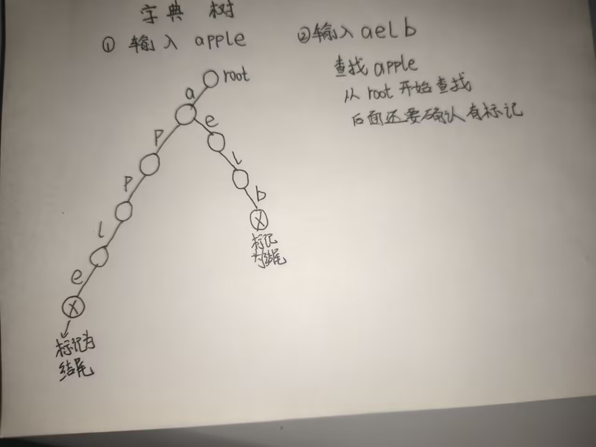

<h1>字典树</h1>

<p>作用：高效地存储和检索字符串集合</p>
<p>让相同前缀相同的字符串共享前缀节点，提高效率。</p>

<div style="text-align:center;">
</div>

我们先来一题简单的字典树题目：

<h2>字典树基础</h2>
<p>题目描述：</p>
<p>给定一个整数n，进行n次操作，每次操作为1或2，1表示插入一个字符串，2表示查询一个字符串是否出现。</p>

```cpp linenums="1" title="字典树基础.cpp"
#include<bits/stdc++.h>
using namespace std;
const int Maxn=100010; 
struct node{
	int son[26];
	bool end;
}tr[Maxn];
int idx;
	void insert(string s){
	int p=0;
		for(char ch:s){
		int c=ch-'a';
			if(!tr[p].son[c])
			tr[p].son[c]=++idx;
			p=tr[p].son[c];
		}
		tr[p].end=true;
	}
	bool query(string s){
		int p=0;
		for(char ch:s){
			int c=ch-'a';
			if(!tr[p].son[c])
			return false;
			p=tr[p].son[c];
		}
		return tr[p].end;
	}
	int main(){
		int n;
		cin>>n;
		while(n--){
			int op;
			string s;
			cin>>op>>s;
			if(op==1)insert(s);
			else
			{
				if(query(s))
				cout<<"YES\n";
				else
				cout<<"NO\n";
			}			
		}
		return 0;
	}
```
本喵依旧解释一下代码：

我们用的char :s
依旧是存储不同的数组

比如说我们输入1 apple

a-'a'=0;
tr[0][0]=1;
p=1;

p-'a'=15;
tr[1][15]=2;
p=2;

p-'a'=15;
tr[2][15]=3;
p=3;

l-'a'=11;
tr[3][11]=4;
p=4;

e-'a'=4;
tr[4][4]=5;
p=5;

tr[p].end=true;

p=0;

```cpp linenums="1" title="字典树.cpp"
#include<bits/stdc++.h>
using namespace std;

const int N=1000010;
struct Node{
    int cnt;
    int nd[26];
}tr[N];
int len;
void insert(string s){
    int p=0;
    for(int i=0;i<s.size();i++){
        int c=s[i]-'a';
        if(tr[p].nd[c]==0){
            tr[p].nd[c]=++len;
        }
        p=tr[p].nd[c];
    }
    tr[p].cnt++;
}

bool search(string s){
    int p=0;
    for(int i=0;i<s.size();i++){
        int c=s[i]-'a';
        if(tr[p].nd[c]==0){
            return false;
        }
        p=tr[p].nd[c];
    }
    return tr[p].cnt>0;
}
int main(){
    memset(tr,0,sizeof(tr));
    len=0;
    int n;
    cin>>n;
    while(n--){
        int op;
        string s;
        cin>>op>>s;
        if(op==1){
            insert(s);
        }
        else{
            cout<<search(s)<<endl;
        }
    }
    return 0;
}
```


